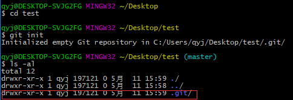

## 关于git使用的最常用的三个命令
```
git init 用于初始化仓库，建立本地版本库，使用前需进入仓库目录
git add 用户添加改动的文件到暂存区
git commit -v 用户提交改动的文件到本地版本库，-v参数用于显示所有的diff信息，也就是改动的地方。
```
## 新建test目录用于测试这三个命令
- git init命令

- git add命令

- git commit命令

